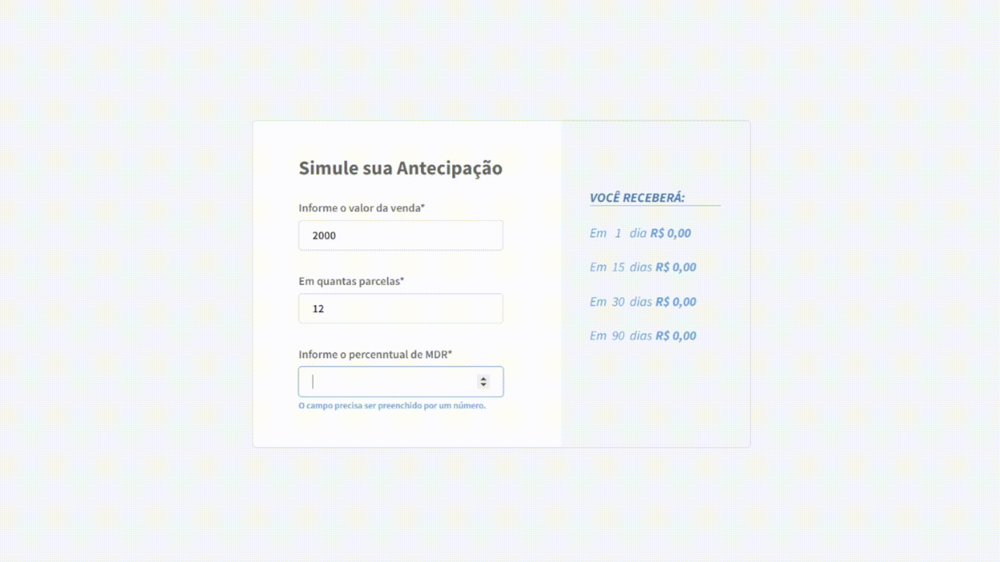

<h1 align="center">
   🧠 Desafio - Front-end 
</h1>

# Desafio calculadora 

Página que calcula o desconto de antecipações de dívidas usando os seguintes campos
amount, mdr e installments.

Este desafio tem como objetivo te avaliar como desenvolvedor Front-end: react, SASS, CSS e a utilização de uma API.

Link da api => https://frontend-challenge-7bu3nxh76a-uc.a.run.app
link do vercel => https://desafio-1-frontend-naianereis27.vercel.app

# Objetivo do projeto

- `Objetivo 1`: JavaScript: aproveite o desafio para mostrar tudo o que sabe sobre as novas features da linguagem.
- `Objetivo 2`: React: siga boas práticas e mantenha o código idiomático. Busque utilizar features recentes e se mantenha atento a problemas comuns como re-renders desnecessários.
- `Objetivo 3`: TypeScript: Opcional. Caso opte por usá-lo, mostre todo o seu domínio.
- `Objetivo 4`: CSS: seja optando por vanilla, pré-processadores ou CSS-in-JS.
- `Objetivo 5`: Componentização.

## Tecnologias

- React
- SASS
- Axios

## Instruções

1. Para rodar o projeto é necessário rodar installar todas as dependências utilizadas no projeto.
   
### `yarn install`

2. Para rodar a aplicação use o seguinte comando.
### `yarn start`

